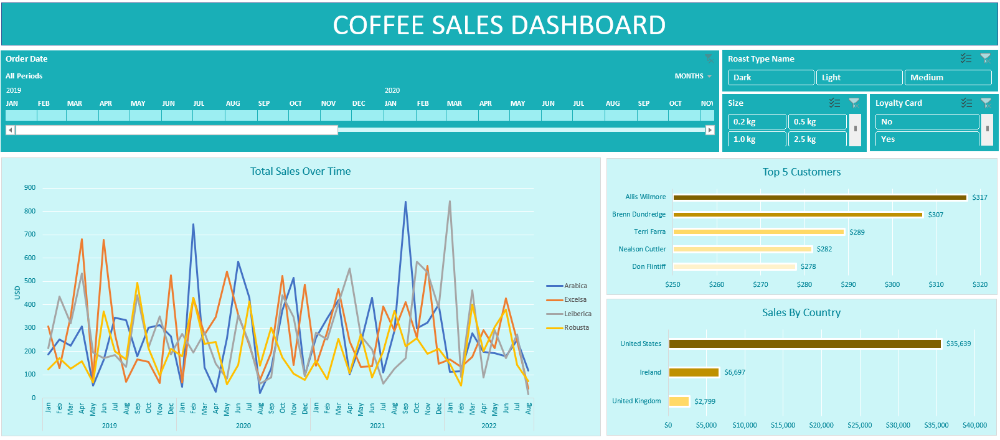

# Coffee Sales Dashboard

## Data Retrieval and Transformation

In the "Orders" table, data from other tables was retrieved into several columns. The following functions were employed for data retrieval:

- **XLOOKUP:** Used to bring data into Customer Name, Email, and Country columns.
- **INDEX and MATCH:** Employed for retrieving data in the Coffee Type, Roast Type, Size, and Unit Price Columns.
- **IF Function:** Applied to convert abbreviated values in the Coffee Type and Roast Type columns to their full names.

## Data Formatting

To enhance the clarity and presentation of the data, the following formatting adjustments were made:

- **Custom Date Format:** The Order Date column was formatted using a custom format (dd-mmm-yyyy) to display dates in a more readable format.
- **Custom Size Format:** The Size column was formatted to display unit (kg) using custom formatting.

## Visualizations

Three main visuals were created using Pivot Tables and Pivot Charts, providing valuable insights into the dataset:

1. **Total Sales Over Time (Line Chart):** A visual representation of total sales trends over time, allowing for the identification of patterns and trends.

2. **Top 5 Customers (Bar Chart):** A bar chart highlighting the top 5 customers based on sales, facilitating quick analysis of customer performance.

3. **Sales by Country (Bar Chart):** A bar chart illustrating sales distribution by country, aiding in the understanding of regional sales performance.

## Interactive Features

To enhance user interactivity and analysis, the following features were implemented:

- **Timeline:** A timeline was added to enable filtering of visuals by months and years, providing a dynamic view of sales trends over different time periods.
- **Slicers:** Three slicers were incorporated to allow users to filter visuals by Size, Roast Type, and Loyalty Card Status, enabling a more granular analysis of the dataset.

## Conclusion

The Excel Dashboard combines efficient data retrieval, thoughtful formatting, and insightful visualizations to provide users with a comprehensive overview of sales data. The interactive features allow for dynamic exploration and analysis, making it a valuable tool for decision-making.
